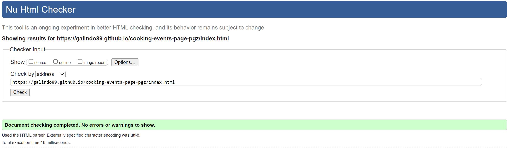
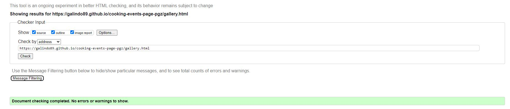
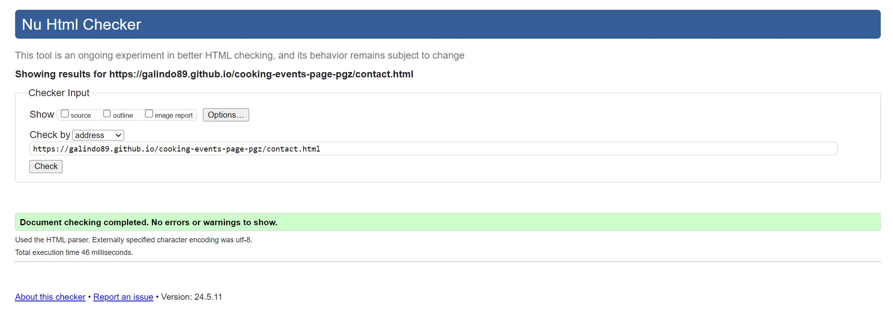
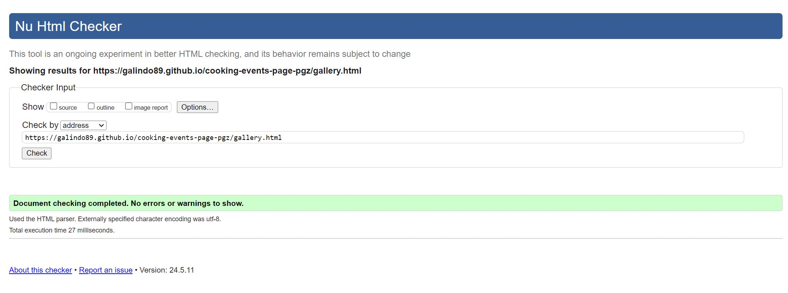
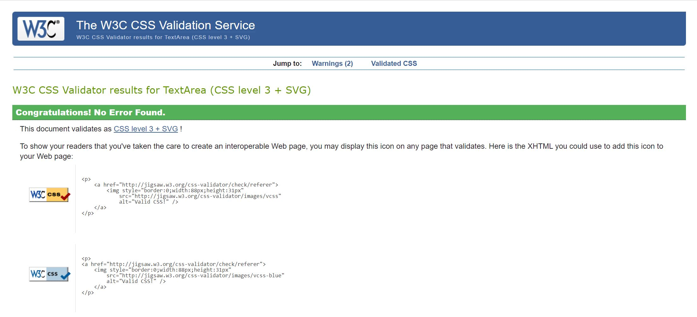

# Cooking Event Service Website

Visit the deployed site: [HH Cooking Events](https://galindo89.github.io/cooking-events-page-pgz/)

A website for showcasing and organizing cooking events in Hamburg, Germany.

## CONTENTS

- [Introduction](#introduction)
  - [Purpose of the project](#purpose-of-the-project)
- [User Experience](#user-experience-ux)
  - [User Stories](#user-stories)
- [Design](#design)
  - [Colour Scheme](#colour-scheme)
  - [Typography](#typography)
  - [Imagery](#imagery)
  - [Wireframes](#wireframes)
  - [Features](#features)
    - [Home Page](#home-page)
    - [Gallery Page](#gallery-page)
    - [Contact Page](#contact-page)
    - [Confirmation Page](#confirmation-page)
    - [Future Implementations](#future-implementations)
  - [Accessibility](#accessibility)
- [Technologies Used](#technologies-used)
  - [Languages Used](#languages-used)
  - [Frameworks, Libraries & Programs Used](#frameworks-libraries--programs-used)
- [Deployment & Local Development](#deployment--local-development)
  - [Deployment](#deployment)
  - [Local Development](#local-development)
    - [How to Fork](#how-to-fork)
    - [How to Clone](#how-to-clone)
- [Testing](#testing)
  - [Feature Testing](#feature-testing)
  - [Browser Compatibility](#browser-compatibility)
  - [Responsiveness Testing](#responsiveness-testing)
  - [Code Validation](#code-validation)
    -[HTML](#HTML)
    -[CSS](#CSS)
  - [Lighthouse Testing](#lighthouse-testing)
  - [Accessibility Testing](#accessibility-testing)
  - [Bugs Documentation](#bugs-documentation)
  - [Solved Bugs](#solved-bugs)
  - [Known Bugs](#known-bugs)
- [Credits](#credits)
  - [Code Used](#code-used)
  - [Content](#content)
  - [Media](#media)
  - [Acknowledgments](#acknowledgments)

## Introduction
### Purpose of the project
The purpose of this project is to create a website for a cooking event service organizer located in Hamburg, Germany. The website is designed to showcase the services and events offered, providing visitors with detailed information and easy navigation.

The main objective is to present a simple, user-friendly, multi-device compatible website that highlights the services provided and the value proposition of these services. Additionally, it includes a gallery displaying previous events and a contact form for users to make reservation requests.

## User Experience (UX)
### User Stories
- As a visitor, I want to learn about the cooking event services offered, so that I can decide if I want to book an event.
- As a potential client, I want to understand what types of cooking events are available, so that I can find an event that interests me.
- As a user, I want to contact the organizer through the website, so that I can ask questions or make a booking.
- As a visitor, I want to see images and descriptions of past events, so that I can get an idea of what to expect.
- As a user, I want to access the website on multiple devices (desktop, tablet, mobile), so that I can browse and book events conveniently from any device.

## Design
### Colour Scheme
The color scheme was chosen to reflect the vibrant and inviting nature of our cooking events, inspired by the rich and diverse cultures of Mediterranean and Latin American cuisine. The selected colors aim to evoke warmth, energy, and a sense of festivity that aligns with the culinary experiences offered.

- Primary Color: `#E28A59` (Background, Buttons)
- Secondary Color: `#F3E542` (Text, Highlights)
- Accent Color: `#7A9E3B` (Hover States)
- Background Color: `#F4F4F4` (Body Background)
- Text Color: `#3A3A3A`

### Typography
For the typography, two primary fonts to enhance readability and complement the vibrant theme of our cooking events were chosen. The selected fonts aim to balance clarity with a touch of elegance, reflecting the high-quality and professional nature of our services. 

- 'Open Sans', sans-serif for general text for its readability and clean appearance.
- 'Merriweather Sans', sans-serif for headings to provide a distinct and stylish look.

### Imagery
Images were chosen to showcase the vibrant and interactive nature of our cooking events, including photos of past events and culinary creations.

### Wireframes
(Add wireframes here)

### Features
The website is designed to provide visitors with a comprehensive and engaging experience, showcasing what the company offers and its specialization in Mediterranean and Latin American food events. Each page serves a specific purpose, ensuring that users can easily find the information they need and interact with the site effectively.

#### Home Page

The home page includes an introduction of the services and the specialization. It is designed to provide essential information at a glance.

#### Gallery Page

The gallery page showcases images of past events to give visitors an idea of what to expect.

#### Contact Page

The contact page includes a form for inquiries and event bookings, allowing users to easily reach out to the organizer.

#### Confirmation Page

The confirmation page displays a thank you message and confirmation details after a user submits the contact form.

#### Future Implementations

Future features may include:

1. Improving the gallery to display a description of the images when users hover over them (for desktop screen sizes) and when users click on them (for mobile and tablet).
2. Integrating the calendar section of the form to display the potential availability on the dates selected by the customer.
3. Adding a blog section for cooking tips and event highlights.

## Technologies Used

### Languages Used

- HTML5
- CSS3

### Frameworks, Libraries & Programs Used

- [Balsamiq](https://balsamiq.com/) - Used to create wireframes.
- [Git](https://git-scm.com/) - For version control.
- [GitHub](https://github.com/) - To save and store the files for the website.
- [GitPod](https://gitpod.io/) - IDE used to create the site.
- [Google Fonts](https://fonts.google.com/) - To import the fonts used on the website.
- [Font Awesome](https://fontawesome.com/) - For icons used on the website.
- [Multi Device Website Mockup Generator](https://techsini.com/multi-mockup/index.php) - To show the website image on a range of devices.
- [W3C Markup Validation Service](https://validator.w3.org/) - For HTML validation.
- [W3C CSS Validation Service](https://jigsaw.w3.org/css-validator/) - For CSS validation.

## Deployment & Local Development

### Deployment

The site is deployed using GitHub Pages - [HH Cooking Events](https://github.com/galindo89/cooking-events-page-pgz).

To deploy the site using GitHub Pages:

1. Log in to GitHub.
2. Go to the repository for this project, [galindo89/cooking-events-page-pgz](https://github.com/galindo89/cooking-events-page-pgz).
3. Click the settings button.
4. Select pages in the left-hand navigation menu.
5. From the source dropdown select main branch and press save.

### Local Development

#### How to Fork

To fork the repository:

1. Log in to GitHub.
2. Go to the repository for this project, [galindo89/cooking-events-page-pgz](https://github.com/galindo89/cooking-events-page-pgze).
3. Click the Fork button in the top right corner.

#### How to Clone

To clone the repository:

1. Log in to GitHub.
2. Go to the repository for this project, [galindo89/cooking-events-page-pgz](https://github.com/galindo89/cooking-events-page-pgz).
3. Click on the code button, select whether you would like to clone with HTTPS, SSH or GitHub CLI and copy the link shown.
4. Open the terminal in your code editor and change the current working directory to the location you want to use for the cloned directory.
5. Type 'git clone' into the terminal and then paste the link you copied in step 3. Press enter.

## Testing
### Feature Testing
(Add details about feature testing here)

### Browser Compatibility
The project was tested in Chrome, Firefox, and Edge. No issues were found.

The results of the testing are presented in the following table:

| Browser tested | Intended appearance | Intended responsiveness | Comment         |
|----------------|---------------------|-------------------------|-----------------|
| Chrome         | Good                | Good                    | No issues found |
| Firefox        | Good                | Good                    | No issues found |
| Edge           | Good                | Good                    | No issues found |

### Responsiveness Testing
The project was tested directly on 3 different screens:
- Mobile: Google Pixel 7
- Notebook: Microsoft Surface Notebook 2
- Desktop monitor: 1920 x 1080 resolution

| Device tested                      | Site responsiveness <= 767 px                                                         | Site responsiveness 768px <= x <= 991px                                                     | Site responsiveness x >= 992px                                                                                     |
|------------------------------------|---------------------------------------------------------------------------------------|---------------------------------------------------------------------------------------------|--------------------------------------------------------------------------------------------------------------------|
| Google Pixel 7                     | Good. All pages rendering content as expected and behaving as implemented              | N/A                                                                                         | N/A                                                                                                                |
| iPad mini (over Chrome's developer console) | N/A                                                                                   | Good. All pages rendering content as expected and behaving as implemented                    | N/A                                                                                                                |
| 1504 x 1003 Microsoft Surface Notebook screen | N/A                                                                                   | N/A                                                                                         | Good. All pages rendering content as expected and behaving as implemented                                            |
| 1920 x 1080 desktop monitor        | N/A                                                                                   | N/A                                                                                         | Good. All pages rendering content as expected and behaving as implemented                                            |

### Code Validation

#### HTML 
HTML code validation was conducted using the [W3C Markup Validation Service](https://validator.w3.org/).

| Page Tested         | Errors                                                                                                                                           | Solutions applied?                                                                                                                      | Screenshot of clear validator output                                           |
|---------------------|--------------------------------------------------------------------------------------------------------------------------------------------------|-----------------------------------------------------------------------------------------------------------------------------------------|--------------------------------------------------------------------------------|
| index.html          | "Error: The element button must not appear as a descendant of the a element. Error: Stray end tag i. Error: Stray end tag i. Error: Stray end tag main." | "Remove the `<button>` elements from inside `<a>` tags. Replace them with styled `<a>` tags or modify the structure to avoid nesting `<button>` inside `<a>`.   Fix the stray end tag `<i>` and `<main>` issues by removing the extra closing tags." |  |
| gallery.html        | No error                                                                                                                                         | N/A                                                                                                                                     |  |
| contact.html        | Error: The value of the for attribute of the label element must be the ID of a non-hidden form control.                                           | Update the "for" attribute of the label   element                                                                                           |  |
| confirmation.html   | No error  | N/A |  |

#### CSS
CSS code was validated using the [W3C CSS Validation Service](https://jigsaw.w3.org/css-validator/validator).

| File      | Errors                                                                                                                    | Solutions applied?                                                                                      | Screenshot of clear validator output                                    |
|-----------|---------------------------------------------------------------------------------------------------------------------------|---------------------------------------------------------------------------------------------------------|--------------------------------------------------------------------------|
| style.css | "Value Error: text-align wrap is not a text-align value: wrap Parse Error /*Center the form in the contact section */ / .contact form { padding: 3rem; width: 60%; border-radius: 10px; } Parse Error }" | Removing unnecessary "text-align variable" from selector Removing unnecessary '/' character" |  |

### Lighthouse Testing
(Add details about Lighthouse testing here)

### Accessibility Testing
(Add details about accessibility testing here)

### Bugs Documentation
(Add details about bugs documentation here)

### Solved Bugs
(Add details about solved bugs here)

### Known Bugs
(Add details about known bugs here)

## Credits
### Code Used
(Add information about code used here)

### Content
(Add information about content here)

### Media
(Add information about media here)

### Acknowledgments
(Add acknowledgments here)

## Purpose of the Project
The purpose of this project is to create a website for a cooking event service organizer located in Hamburg, Germany. The website is designed to showcase the services and events offered, providing visitors with detailed information and easy navigation.

The main objective here is to present a simple website that presents the services provided and the value proposition of the serivces. Furthermore it presents also a gallery that displays previous events. It also provides the suer with a contact for for them to make request for reservations. 

## User Stories
- As a visitor, I want to learn about the cooking event services offered, so that I can decide if I book one event. 
- As a potential client, I want to understand what types of cooking events are available, so that I can find an event that interests me.
- As a user, I want to contact the organizer through the website, so that I can ask questions or make a booking.
- As a visitor, I want to see images and descriptions of past events, so that I can get an idea of what to expect.

## Features

#### Home Page

The home page includes an introduction and featured events to engage visitors and provide essential information at a glance.

#### Gallery Page

The gallery page showcases images of past events to give visitors an idea of what to expect.

#### Contact Page

The contact page includes a form for inquiries and event bookings, allowing users to easily reach out to the organizer.

#### Confirmation Page

The confirmation page displays a thank you message and confirmation details after a user submits the contact form.

- **Footer:** Social media links and copyright information.

## Pages
- **index.html:** Home page with introduction and featured events.
- **gallery.html:** Gallery page showcasing images of past events.
- **contact.html:** Contact page with a form for inquiries and event bookings.
- **confirmation.html:** Confirmation page to display after form submission (assuming this is included based on the form action).

## Future Features
- User login and registration for event booking.
- A service page that provides more details of the different services including calls to action and pricings.  
- Calendar view for availabilty
- Improving the gallery by allowing the user to get a description of the images when hovering over or clicking on them
- Blog section for cooking tips and event highlights.

## Typography and Color Scheme
- **Typography:** 
  - Primary Font: 'Open Sans', sans-serif
  - Secondary Font: 'Merriweather Sans', sans-serif
- **Color Scheme:**
  - Primary Color: #E28A59 (Background, Buttons)
  - Secondary Color: #F3E542 (Text, Highlights)
  - Accent Color: #7A9E3B (Hover States)
  - Background Color: #F4F4F4 (Body Background)
  - Text Color: #3A3A3A

## Wireframes
- Home Page: 
- Services Page: 
- Events Page: 

## Technology
- **HTML5**
- **CSS3**
- **Git & GitHub**

## Testing
### 8.1 Code Validation
- HTML: Tested using W3C Markup Validation Service [https://validator.w3.org/]
- CSS: Tested using W3C CSS Validation Service [https://jigsaw.w3.org/css-validator/]

### 8.2 Test Cases (User Story Based with Screenshots)
- **User Story 1:** Viewing service details - 
- **User Story 2:** Contacting the organizer - 

### 8.3 Fixed Bugs
- Fixed navigation bar alignment issues.
- Fixed date picker incon issue. 
- Resolved form validation errors on the contact page.

### 8.4 Supported Screens and Browsers
- **Screens:** Desktop, Tablet, Mobile
- **Browsers:** Chrome, Firefox, Safari, Edge

## Deployment
### 9.1 Via Gitpod
- Set up a Gitpod workspace for development.
- Regularly pushed commits to the GitHub repository.

### 9.2 Via GitHub Pages
- Deployed the website using GitHub Pages.
- To view the site, visit [GitHub Pages Deployment URL - TBD].

## Credits
- **Development:** Pablo Galindo Zapata
- **Images and Videos:**
  - Source of images: [source if applicable]
  - Source of videos: [source if applicable]
- **CSS and HTML Help:**
  - Stack Overflow
- **Contact:** For more information, please contact us at [pablo.galindozapata@gmail.com].