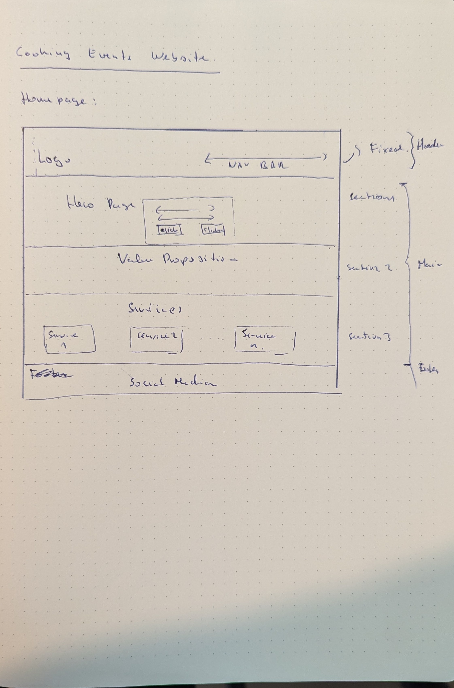

# Cooking Event Service Website

Visit the deployed site: [HH Cooking Events](https://galindo89.github.io/cooking-events-page-pgz/)

A website that presents an cooking event service provided with passion for mediterranean and latin american food that organizes private cooking events in Hamburg, Germany

## CONTENTS

- [Cooking Event Service Website](#cooking-event-service-website)
  - [CONTENTS](#contents)
  - [Introduction](#introduction)
    - [Purpose of the project](#purpose-of-the-project)
  - [User Experience (UX)](#user-experience-ux)
    - [User Stories](#user-stories)
  - [Design](#design)
    - [Colour Scheme](#colour-scheme)
    - [Typography](#typography)
    - [Imagery](#imagery)
    - [Wireframes](#wireframes)
    - [Features](#features)
      - [Home Page](#home-page)
      - [Gallery Page](#gallery-page)
      - [Contact Page](#contact-page)
      - [Confirmation Page](#confirmation-page)
      - [Future Implementations](#future-implementations)
  - [Technologies Used](#technologies-used)
    - [Languages Used](#languages-used)
    - [Frameworks, Libraries \& Programs Used](#frameworks-libraries--programs-used)
  - [Deployment \& Local Development](#deployment--local-development)
    - [Deployment](#deployment)
    - [Local Development](#local-development)
      - [How to Fork](#how-to-fork)
      - [How to Clone](#how-to-clone)
  - [Testing](#testing)
    - [Feature Testing](#feature-testing)
    - [Browser Compatibility](#browser-compatibility)
    - [Responsiveness Testing](#responsiveness-testing)
    - [Code Validation](#code-validation)
      - [HTML](#html)
      - [CSS](#css)
    - [Lighthouse Testing](#lighthouse-testing)
    - [Bugs Documentation](#bugs-documentation)
    - [Solved Bugs](#solved-bugs)
    - [Known Bugs](#known-bugs)
  - [Credits](#credits)
    - [Code Used](#code-used)
    - [Final Declaration of authenticity and credit.](#final-declaration-of-authenticity-and-credit)
    - [Media](#media)
    - [Acknowledgments](#acknowledgments)
    - [Contact](#contact)

## Introduction
### Purpose of the project
The purpose of this project is to create a website for a cooking event service organizer located in Hamburg, Germany. The website is designed to showcase the services and events offered, providing visitors with detailed information and easy navigation.

The main objective is to present a simple, user-friendly, multi-device compatible website that highlights the services provided and the value proposition of these services. Additionally, it includes a gallery displaying previous events and a contact form for users to make reservation requests.

## User Experience (UX)
### User Stories
- As a visitor, I want to learn about the cooking event services offered, so that I can decide if I want to book an event.
- As a potential client, I want to understand what types of cooking events are available, so that I can find an event that interests me.
- As a user, I want to contact the organizer through the website, so that I can ask questions or make a booking.
- As a visitor, I want to see images and descriptions of past events, so that I can get an idea of what to expect.
- As a user, I want to access the website on multiple devices (desktop, tablet, mobile), so that I can browse and book events conveniently from any device.

## Design
### Colour Scheme
The color scheme was chosen to reflect the vibrant and inviting nature of our cooking events, inspired by the rich and diverse cultures of Mediterranean and Latin American cuisine. The selected colors aim to evoke warmth, energy, and a sense of festivity that aligns with the culinary experiences offered.

- Primary Color: `#E28A59` (Background, Buttons)
- Secondary Color: `#F3E542` (Text, Highlights)
- Accent Color: `#7A9E3B` (Hover States)
- Background Color: `#F4F4F4` (Body Background)
- Text Color: `#3A3A3A`

### Typography
For the typography, two primary fonts to enhance readability and complement the vibrant theme of our cooking events were chosen. The selected fonts aim to balance clarity with a touch of elegance, reflecting the high-quality and professional nature of our services. 

- 'Open Sans', sans-serif for general text for its readability and clean appearance.
- 'Merriweather Sans', sans-serif for headings to provide a distinct and stylish look.

### Imagery
Images were chosen to showcase the vibrant and interactive nature of our cooking events, including photos of past events and culinary creations.

### Wireframes
During the design phase, wireframes were used to sketch the potential structure of the web page, especially for the mobile and desktop versions. The wireframes were hand-sketched. The following pictures show the sketches produced:

### Features
The website is designed to provide visitors with a comprehensive and engaging experience, showcasing what the company offers and its specialization in Mediterranean and Latin American food events. Each page serves a specific purpose, ensuring that users can easily find the information they need and interact with the site effectively.

#### Home Page

The home page includes an introduction of the services and the specialization. It is designed to provide essential information at a glance.

#### Gallery Page

The gallery page showcases images of past events to give visitors an idea of what to expect.

#### Contact Page

The contact page includes a form for inquiries and event bookings, allowing users to easily reach out to the organizer.

#### Confirmation Page

The confirmation page displays a thank you message and confirmation details after a user submits the contact form.

#### Future Implementations

Future features may include:

1. Improving the gallery to display a description of the images when users hover over them (for desktop screen sizes) and when users click on them (for mobile and tablet).
2. Integrating the calendar section of the form to display the potential availability on the dates selected by the customer.
3. Adding a blog section for cooking tips and event highlights.

## Technologies Used

### Languages Used

- HTML5
- CSS3

### Frameworks, Libraries & Programs Used

- [Git](https://git-scm.com/) - For version control.
- [GitHub](https://github.com/) - To save and store the files for the website.
- [GitPod](https://gitpod.io/) - IDE used to create the site.
- [Google Fonts](https://fonts.google.com/) - To import the fonts used on the website.
- [Font Awesome](https://fontawesome.com/) - For icons used on the website.
- [Multi Device Website Mockup Generator](https://techsini.com/multi-mockup/index.php) - To show the website image on a range of devices.
- [W3C Markup Validation Service](https://validator.w3.org/) - For HTML validation.
- [W3C CSS Validation Service](https://jigsaw.w3.org/css-validator/) - For CSS validation.

## Deployment & Local Development

### Deployment

The site is deployed using GitHub Pages - [HH Cooking Events](https://github.com/galindo89/cooking-events-page-pgz).

To deploy the site using GitHub Pages:

1. Log in to GitHub.
2. Go to the repository for this project, [galindo89/cooking-events-page-pgz](https://github.com/galindo89/cooking-events-page-pgz).
3. Click the settings button.
4. Select pages in the left-hand navigation menu.
5. From the source dropdown select main branch and press save.

### Local Development

#### How to Fork

To fork the repository:

1. Log in to GitHub.
2. Go to the repository for this project, [galindo89/cooking-events-page-pgz](https://github.com/galindo89/cooking-events-page-pgze).
3. Click the Fork button in the top right corner.

#### How to Clone

To clone the repository:

1. Log in to GitHub.
2. Go to the repository for this project, [galindo89/cooking-events-page-pgz](https://github.com/galindo89/cooking-events-page-pgz).
3. Click on the code button, select whether you would like to clone with HTTPS, SSH or GitHub CLI and copy the link shown.
4. Open the terminal in your code editor and change the current working directory to the location you want to use for the cloned directory.
5. Type 'git clone' into the terminal and then paste the link you copied in step 3. Press enter.

## Testing
### Feature Testing

In the feature testing phase, we conducted a series of tests to ensure that all key functionalities of the website are working as intended. We tested various components across different pages, including the navigation bar, footer, buttons, sections, and forms. Each feature was tested in different scenarios to verify their behavior and responsiveness.

All test cases were conducted using three different web browsers:
- Google Chrome
- Firefox
- Microsoft Edge

The devices used for the testing were:
- Google Pixel 7
- Microsoft Surface Notebook 2
- 1920 x 1080 desktop monitor

Below is a summary of the test cases and their results.

| Feature                | Page         | Scenario                                                                                                       | Steps                                                                                                       | Expected result                                                                                                                                                                                                                                                                                                | Result |
| ---------------------- | ------------ | -------------------------------------------------------------------------------------------------------------- | ----------------------------------------------------------------------------------------------------------- | -------------------------------------------------------------------------------------------------------------------------------------------------------------------------------------------------------------------------------------------------------------------------------------------------------------- | ------ |
| Navigation bar         | All          | User clicks on Logo section                                                                                    | Go to any of the pages and click on the Cooking Event logo                                                  | User is redirected to the home page in the same tab                                                                                                                                                                                                                                                            | Passed |
| Navigation bar         | All          | User clicks on any of the links available                                                                      | Go to any of the pages. On the top right click on any of the available links                                | User is redirected to the corresponding page in the same tab. When in the page the navigation bar highlights the page where you currently are                                                                                                                                                                  | Passed |
| Navigation bar         | All          | User is accessing the page with a device with a screen smaller than 768px. User goes to the navigation section | Go to the navigation section.                                                                               | Navigation links will be hidden and instead the UI will present a burger button. When clicking on it the UI will present the list of pages (Home, Gallery, Contact)                                                                                                                                            | Passed |
| Footer                 | All          | User clicks on any of the social media links available                                                         | Go to the footer section of any of the pages. Click on any of the social media links                        | User will be directed to the corresponding social media site. A new tab is opened.                                                                                                                                                                                                                             | Passed |
| Home page              | Home page    | User enters the home page                                                                                      | Enter the URL of the page or click on any of the links that directs to the home page                        | Home page loads. The hero section is loaded and a message including 2 buttons is displayed                                                                                                                                                                                                                     | Passed |
| Learn More Button      | Home page    | User is in the home page and clicks on the "Learn More" button                                                 | Go to the home page, in the hero image section, 2 buttons will be displayed. Click on the Learn More button | The user will be directed to the specialization and services sections that are also part of the home page                                                                                                                                                                                                      | Passed |
| Contact Us Button      | Home page    | User is in the home page and clicks on the "Contact Us" button                                                 | Go to the home page, in the hero image section, 2 buttons will be displayed. Click on "Contact Us" button   | The user will be directed to the contact page. There the user will be able to fill in a form to submit a request for reservation or for interest into a specific event                                                                                                                                         | Passed |
| Specialization section | Home page    | User accesses the home page                                                                                    | Go to the home page. Scroll down below the hero section                                                     | User is presented with a description of what is the specialty of the service provider                                                                                                                                                                                                                          | Passed |
| Services section       | Home page    | User accesses the home page                                                                                    | Go to the home page. Scroll down below the specialization section                                           | User is presented with a description of the different types of cooking events offered                                                                                                                                                                                                                          | Passed |
| Gallery with pictures  | Gallery      | User accesses the gallery page                                                                                 | Click on any link leading to the gallery section                                                            | User will be displayed with a different number of images. For screens with a width bigger than 1200px, the images will be displayed in four columns. For screens between 768px and 1200px, the images will be displayed in two columns. For any screen below 768px, the images will be displayed in one column | Passed |
| Submit Form            | Contact      | User accesses the contact page                                                                                 | Click on any link leading to the contact page                                                               | User is directed to the contact page in the same tab. Page loads a form with several fields to fill in                                                                                                                                                                                                         | Passed |
| Submit Form            | Contact      | Users fill in the contact page                                                                                 | Go to the contact page. Start filling in the form                                                           | User is able to fill in the form. The UI displays clearly which fields are mandatory                                                                                                                                                                                                                           | Passed |
| Submit Form            | Contact      | Users click on submit form. Form has still required fields empty                                               | Go to the contact page. Click on submit form button                                                         | User is notified by the UI that the form is still incomplete. User cannot submit the form                                                                                                                                                                                                                      | Passed |
| Submit Form            | Contact      | Users click on submit form. Form has all mandatory fields properly filled in                                   | Go to the contact page. Fill in all mandatory fields from the form                                          | User is directed to a confirmation page in the same tab. The confirmation page confirms the user that the request has been successfully sent. It presents also besides the navigation bar a home button for the user to go back to the home page                                                               | Passed |
| Confirmation message   | Confirmation | User clicks on the home button                                                                                 | In the confirmation page, below the confirmation message, click on the home button                          | User is directed to the home page in the same tab                                                                                                                                                                                                                                                              | Passed |

### Browser Compatibility
The project was tested in Chrome, Firefox, and Edge. No issues were found.

The results of the testing are presented in the following table:

| Browser tested | Intended appearance | Intended responsiveness | Comment         |
| -------------- | ------------------- | ----------------------- | --------------- |
| Chrome         | Good                | Good                    | No issues found |
| Firefox        | Good                | Good                    | No issues found |
| Edge           | Good                | Good                    | No issues found |

### Responsiveness Testing
The project was tested directly on 3 different screens:
- Mobile: Google Pixel 7
- Notebook: Microsoft Surface Notebook 2
- Desktop monitor: 1920 x 1080 resolution

| Device tested                                 | Site responsiveness <= 767 px                                             | Site responsiveness 768px <= x <= 991px                                   | Site responsiveness x >= 992px                                            |
| --------------------------------------------- | ------------------------------------------------------------------------- | ------------------------------------------------------------------------- | ------------------------------------------------------------------------- |
| Google Pixel 7                                | Good. All pages rendering content as expected and behaving as implemented | N/A                                                                       | N/A                                                                       |
| iPad mini (over Chrome's developer console)   | N/A                                                                       | Good. All pages rendering content as expected and behaving as implemented | N/A                                                                       |
| 1504 x 1003 Microsoft Surface Notebook screen | N/A                                                                       | N/A                                                                       | Good. All pages rendering content as expected and behaving as implemented |
| 1920 x 1080 desktop monitor                   | N/A                                                                       | N/A                                                                       | Good. All pages rendering content as expected and behaving as implemented |

### Code Validation

#### HTML 
HTML code validation was conducted using the [W3C Markup Validation Service](https://validator.w3.org/).

| Page Tested       | Errors                                                                                                                                                            | Solutions applied?                                                                                                                                                                                                                                         | Screenshot of clear validator output                                                          |
| ----------------- | ----------------------------------------------------------------------------------------------------------------------------------------------------------------- | ---------------------------------------------------------------------------------------------------------------------------------------------------------------------------------------------------------------------------------------------------------- | --------------------------------------------------------------------------------------------- |
| index.html        | "Error: The element button must not appear as a descendant of the a element. Error: Stray end tag i. Error: Stray end tag i. Error: Stray end tag main." | "Remove the `<button>` elements from inside `<a>` tags. Replace them with styled `<a>` tags or modify the structure to avoid nesting `<button>` inside `<a>`.   Fix the stray end tag `<i>` and `<main>` issues by removing the extra closing tags." |  |
| gallery.html      | No error                                                                                                                                                          | N/A                                                                                                                                                                                                                                                        |             |
| contact.html      | Error: The value of the for attribute of the label element must be the ID of a non-hidden form control.                                                           | Update the "for" attribute of the label   element                                                                                                                                                                                                          |   |
| confirmation.html | No error                                                                                                                                                          | N/A                                                                                                                                                                                                                                                        |   |

#### CSS
CSS code was validated using the [W3C CSS Validation Service](https://jigsaw.w3.org/css-validator/validator).

| File      | Errors                                                                                                                                                                                                       | Solutions applied?                                                                              | Screenshot of clear validator output                                              |
| --------- | ------------------------------------------------------------------------------------------------------------------------------------------------------------------------------------------------------------ | ----------------------------------------------------------------------------------------------- | --------------------------------------------------------------------------------- |
| style.css | "Value Error: text-align wrap is not a text-align value: wrap Parse Error /*Center the form in the contact section */ / .contact form { padding: 3rem; width: 60%; border-radius: 10px; } Parse Error" | Removing unnecessary "text-align variable" from selector Removing unnecessary '/' character" |  |

### Lighthouse Testing

Lighthouse testing was executed using the plugin from Chrome's developer tools. The tests were conducted for both mobile and desktop versions of the site. The test analyzed performance, accessibility, SEO, and best practices. 

The results show that for both mobile and desktop, accessibility, SEO, and best practices were excellent. However, there is room for improvement on the performance side for mobile. Although it was possible to increase the performance results for mobile by optimizing the hero image, additional steps are necessary.

Below are the results:
- For mobile before optimizing the hero image:
  - 
- For mobile after optimizing the hero image:
  - 
- For desktop:
  - 

### Bugs Documentation

During the implementation and testing phase of this project, there where several bugs identified and solved. The table  below presets the bugs identified. Consider please that during the implementation there were definitely more bugs, but they grudally solved while implementing and poloshing the page. Therefore they may not be listed here. 

| Bug                                                                                                               | How we solved it                                                                                                                                                                                                           | Status             |
| ----------------------------------------------------------------------------------------------------------------- | -------------------------------------------------------------------------------------------------------------------------------------------------------------------------------------------------------------------------- | ------------------ |
| Original hero image of the home page was distorted. The faces of some of the people in the picture were stretched | We replaced the hero image with another one                                                                                                                                                                                | Fixed and deployed |
| Picture not displaying in the gallery section                                                                     | The picture got renamed and mistakenly deleted during the updates to the names of the folders to comply with naming conventions. We updated the corresponding image element in the gallery section and uploaded a new file | Fixed and deployed |
| Calendar icon in the calendar field of the Contact form not visible                                               | The icon's color was not contrasting with the form's background. This was due to how the web browser was rendering that icon. To solve the issue, it was necessary to hide the default icon and set up a new one.          | Fixed and deployed |

### Solved Bugs
See above.

### Known Bugs
As of now, after the testing conducted on this page, there are no known bugs. It is important to mention that during the Lighthouse testing, the performance of the web page for mobile provided several insights on specific sections of the web page that need to be improved.

## Credits
### Code Used
This web page was generated by the authr, using the skills and knowledge gathered during the modules of HTML and CSS. It is important to mention that although the majority of the code was produced by him, he guided himself specially the Love-Running project. In particular, the following two sections provided good examples to Mr. Galindo Zapata:

1. Gallery section
2. Hiding the nav bar for different screen sizes and creating a "burger" navigation menu.

Furthermore, there was an implementation to solve one of the bugs related to the calendar icon in the contact form. You can find a link to the code solution [here](https://stackoverflow.com/questions/76844615/how-to-style-the-calendar-icon-in-a-date-input).

### Final Declaration of authenticity and credit.

I affirm that the content in this README and the codebase is my original work and that no plagiarism has occurred in its creation. 

### Media
All background and gallery images are sourced from Pexels and iStock. I have a subscription to iStock, granting me the rights to use their pictures. For Pexels, I only download free-to-use images.
### Acknowledgments

1. I want to thank my tutor for all the guidance given during the project.
2. I also want to thank the community from Code Institute. Their timely questions, comments in the Slack channels, and willingness to help each other made this project less difficult.
3. I am grateful to the Code Institute team for the provided material and examples, which guided us on how to proceed with this project.
4. I would like to acknowledge and thank the YouTube channel [Slaying The Dragon](https://www.youtube.com/@slayingthedragon) for their excellent tutorials, especially for CSS, which were of great help.

### Contact
For more information about the page,  please contact  [pablo.galindozapata@gmail.com].